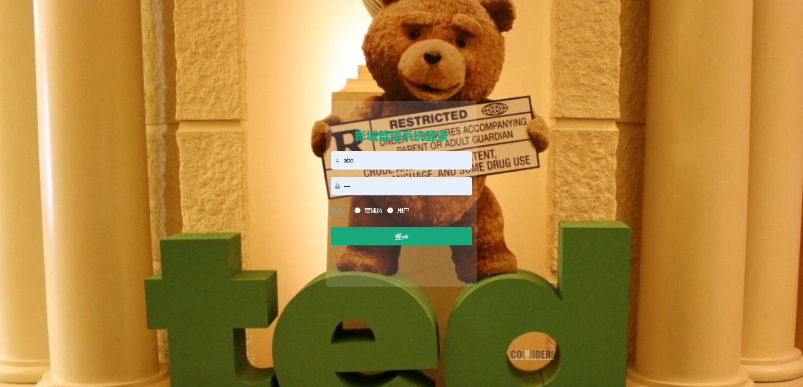
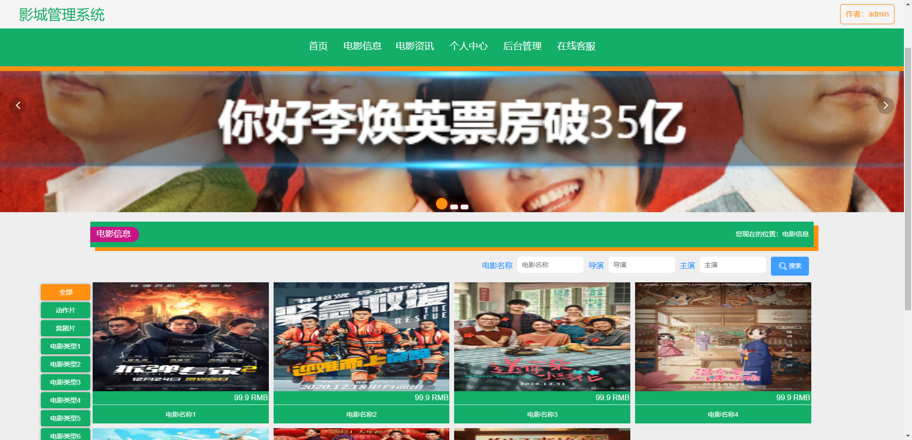
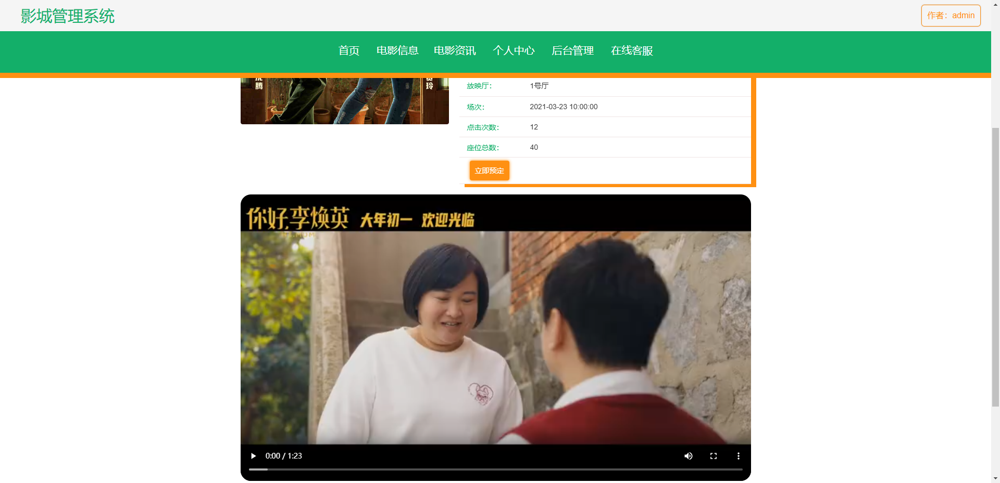
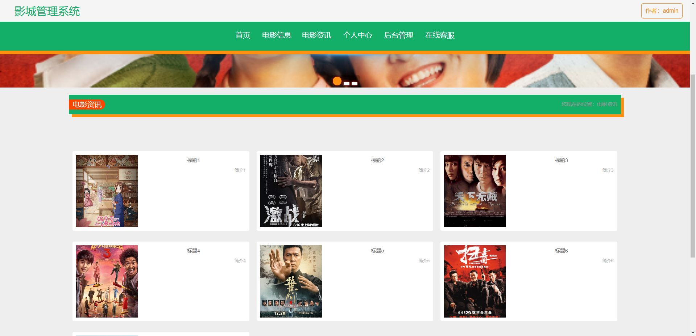
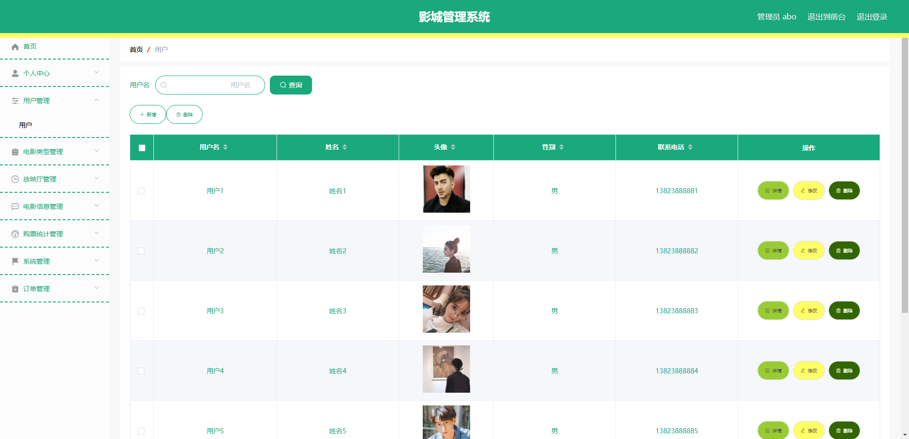
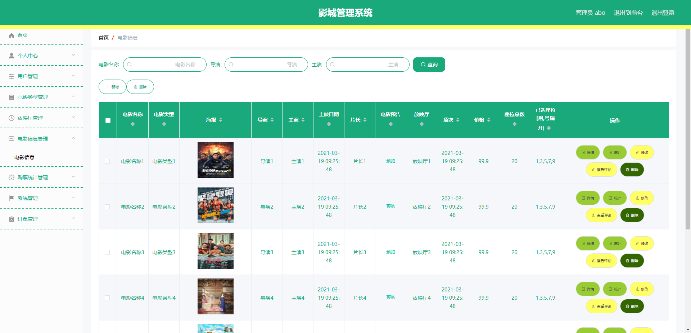
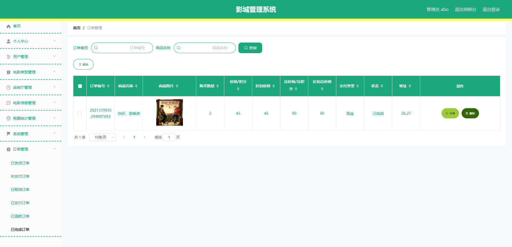
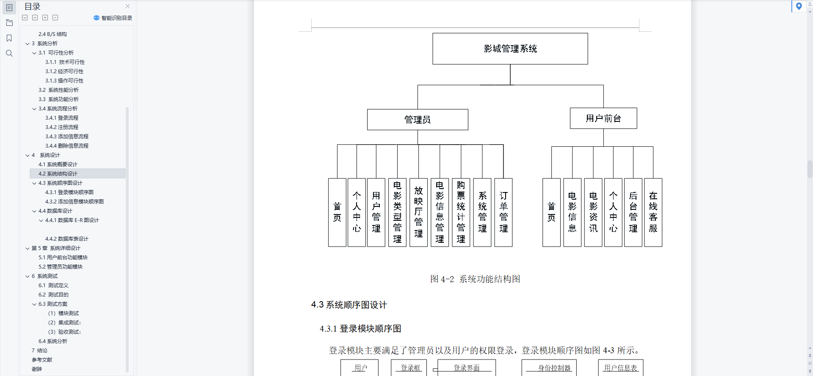
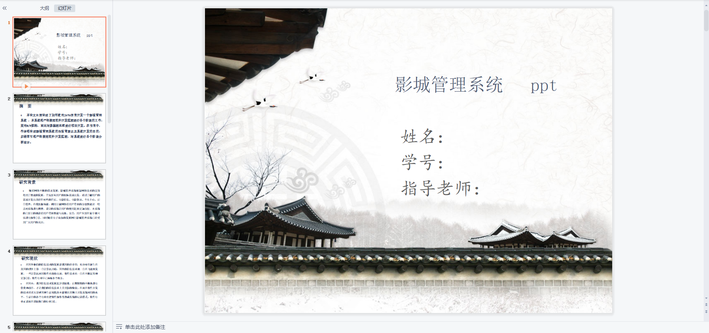
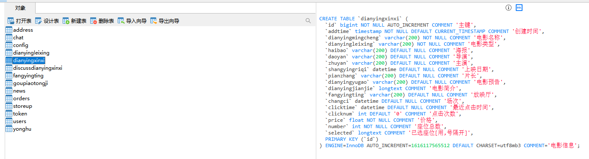

# 1 项目介绍
基于SSM+Vue的影城管理系统：后端 SpringBoot、Mybatis-Plus，前端Vue+ElementUI，具体功能如下：
## 管理端
- 用户管理
- 电影类型管理
- 放映厅管理
- 电影信息管理
- 购票统计管理
- 系统管理：包括轮播图管理、资讯管理、在线客服
- 订单管理
- 个人中心：查看和修改个人信息
## 用户端
- 查看电影信息
- 查看电影资讯
- 个人中心：查看和修改个人信息
- 在线客服
# 2 系统运行截图
## 2.1 用户登录

## 2.2 电影信息

## 2.3 电影详情

## 2.4 资讯信息

## 2.5 用户管理

## 2.6 电影信息管理

## 2.7 订单管理

## 2.8 万字文档

## 2.9 ppt

# 3 数据库设计

# 4 源码数据库获取(收费)

